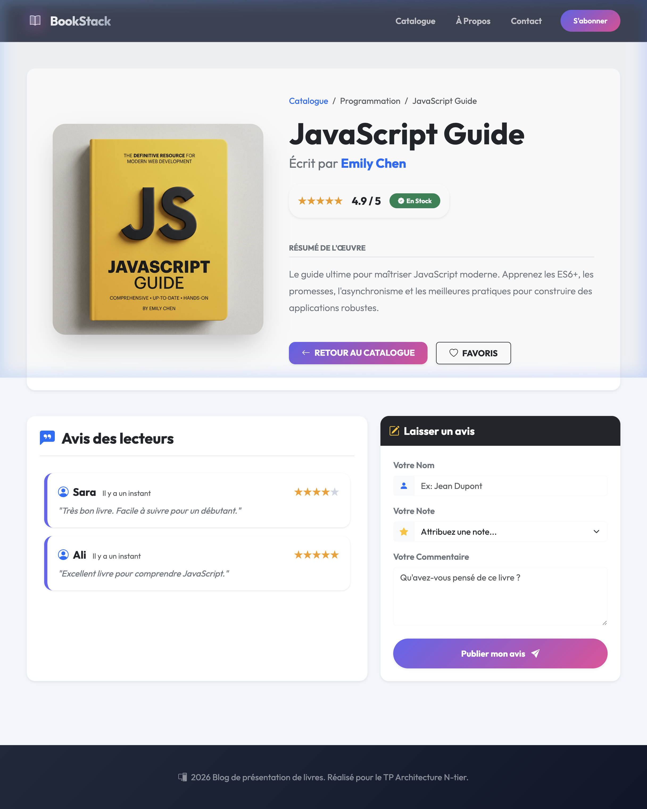
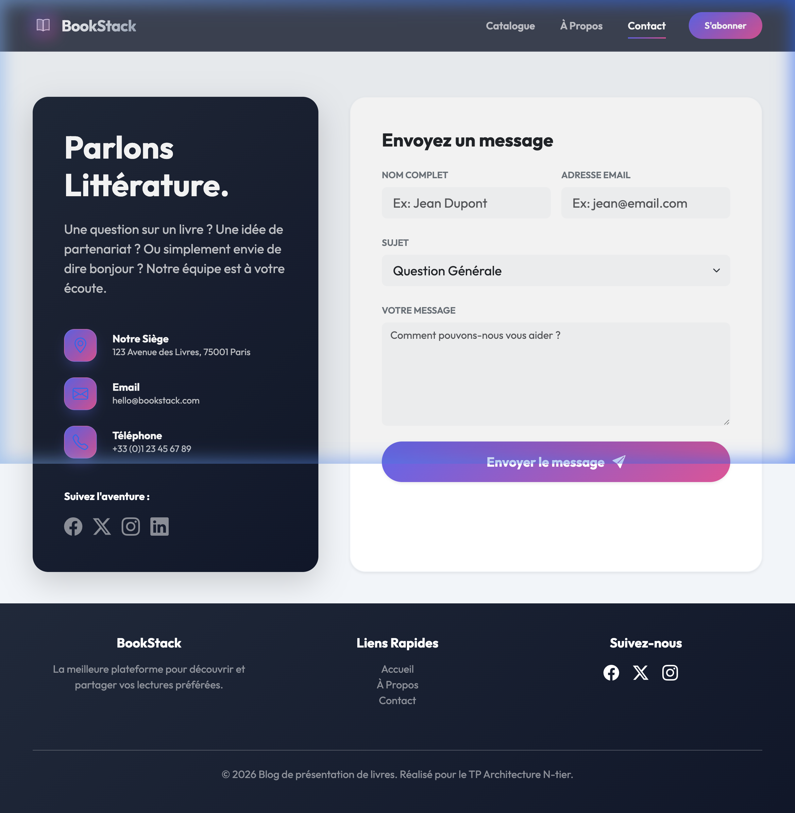

#  BookStack - Blog de Livres Moderne

Bienvenue sur **BookStack**, une plateforme web moderne et élégante pour découvrir, filtrer et partager des avis sur vos lectures préférées. Ce projet a été réalisé dans le cadre du **TP Architecture N-tier**.

##  Caractéristiques

- **Interface Premium** : Design moderne avec glassmorphisme, dégradés vibrants et animations fluides.
- **Catalogue Dynamique** : Parcourez une collection de livres avec filtrage par catégorie et recherche en temps réel.
- **Détails des Livres** : Pages dédiées pour chaque ouvrage avec résumé, note et statut de stock.
- **Système d'Avis** : Laissez vos propres commentaires et notes sur les livres.
- **Responsive Design** : Expérience optimisée pour ordinateurs, tablettes et smartphones.

##  Aperçu de l'Interface

### Page d'Accueil

### Détails du Livre & Avis

### À Propos

### Contact

##  Technologies Utilisées

- **Frontend** : HTML5, CSS3 (Vanilla CSS), JavaScript (ES6).
- **Style** : Bootstrap 5, Bootstrap Icons, Google Fonts (Outfit).
- **Données** : JSON (Simulant une API de base de données).

##  Installation & Utilisation

1. Clonez ou téléchargez le répertoire du projet.
2. Pour que les fonctionnalités de recherche et de chargement des données fonctionnent (via `fetch`), vous devez exécuter le projet via un serveur web local.
   - **Exemple avec VS Code** : Utilisez l'extension "Live Server".
   - **Exemple avec Python** : `python3 -m http.server 8000`
3. Ouvrez `index.html` dans votre navigateur via l'adresse du serveur local (ex: `http://localhost:8000`).

---
*© 2026 Blog de présentation de livres. Réalisé pour le TP Architecture N-tier.*
